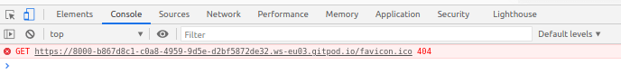

# Testing Film Anseo

## Manual Testing

Functionality tested on various device/browser combinations, for example:
* Chrome on Android, Moto G7
* Safari on iPad
* Firefox on Mac (Mojave)
* Safari on iPhone
* Chrome on Dell (Linux)
* Opera on Dell (Linux)

The reults of these tests are described below. 

## Testing User Stories 
The main criteria for used for testing the overall fuctinality of the site are the user stories. A quick note on whether the criteria are met for each user story follows:
* I am among a group of tourists sitting at a cafe table after lunch wondering where we'll go for the afternoon. After finding the site, we can easily view the map, discuss the films, chat about the movie trivia and make a decision on whether or not to go to the location based on weather info.
    * I think the criteria for this user story are met. The film and weather data is working and accessibly presented. Points for improvement might be:
        * A longer list of films
        * Integrate directions or public transport finder Functionality
        * Where applicable, integrate additional local trivia related to the filming of the movie - eg every night after filming the actors used to go for a drink in a particular local pub that now has a whole wall of related items and photos

* As a first-time user of the site, the information required to use the map and understand what is being presented is clearly accessible.
    * The How To Use The Map section is clearly visible on the page when a user arrives on the site. The information there is clear and at the same time can be easily hidden once the user no longer requires it. Once hidden, the information does not continue to negatively impact user experience.
    * The weather icon is clearly visible and the presence of additional info is clearly demonstrated by use of color (toggle) and cursor change.
    * The weather info itself is clearly laid out and easy to consume.
    * Likewise, the presence of additional movie info is illustrated by text (Show More), color toggle, and cursor change.

* As a repeat user of the site, I do not need to consult the directions of how to interact with the site. The information that is acessible for a first-time user does not impinge on my use of the map - ie the info can easily be ignored.
    * As a return visitor, I fond the site layout to be clean and any instructional info is hidden. The map is the central focus.

* As a tourist/visitor who has been impressed with their visit to a location, I would like to keep the experience alive by following up with some connected activity. For example, after visiting the Cliffs of Moher, I can check the site and then decide to watch Princess Bride on the bus ride back to Dublin.
    * Repeat of point 1 above. 
* As a group of friends spending time together for a weekend and looking for a diversion, the site serves as a source of valuable location-specific weather info and also as a talking point.
    * OK - same functionality as 1 above.
* As an administrator at a local tourist office, I can easily get in touch with the site curator to highlight a movie made in the vicinity, thus adding to the list of local tourist attractions.
    * The Contact area of the site is easily accessible by scrolling or by using the navigation option. The form itself offers scope to give information relevant to a film or to add a free text message with additional info, a corrections etc. The form gives user feedback if required elements are not provided or not provided in a valid format (eg email). Similarly, the form gives user feedback (alert, must be confirmed) on successsful submisison of the message and then clears the form for a clean user experience.  


## JSHint
JSHint is used to validate the JS code.

Several warnings were found during testing:

#### Unused Variable in audio.js (Function Name)
JSHint says that a function is an unused variable. I have looked into this and find there to be no error, so leaving as is:
```Javascript
let playAnseo = document.getElementById("anseo-audio");

function playAudio(){
    playAnseo.play();
}
```

#### Unused Variables in main.js relating to Google or jQuery
JSHint reports 'google' to be an undefined variable on the following line:
```Javascript
mapTypeId: google.maps.MapTypeId.TERRAIN
```
It reports '$' to be an undefined variable on the following line:
```Javascript
$('#optional-movie-details').on('click', '#toggle-bar', function () {
```
As above, I have looked into these JSHint warnings and found there to be no issue.


#### Unused Variables in sendEmail.js
Similar to issue described above, JSHint reports an undefined variable and an unused variable for 'sendMail' and 'emailjs' in the following lines:
```Javascript
function sendMail(contactForm){
    emailjs.send("service_xm6go8k","template_bk2ro5o",{
```
Based on previous finding - have ignored this.

#### JSHint Warnings re ES6
For main.js, JSHint reported 51 warnings as follows:
 	'let' is available in ES6 (use 'esversion: 6') or Mozilla JS extensions (use moz).
    'template literal syntax' is only available in ES6 (use 'esversion: 6').

After looking into this, I resolved the issue by adding the following line to the top of the Javascript file (also for other Javascript files):
```Javascript
/*jshint esversion: 6*/
```
After adding this line, wrnings disappear. For more, see discussion on CI Slack.

## CSS
CSS was validated periodically at https://jigsaw.w3.org/css-validator/validator and all reported errors checked and resolved. For example, the line for padding-right below returned "Value Error : padding-right Too many values or values are not recognized : 0 10px 0"
Resolved by changing 'padding-right' to 'padding' and including 'px'.
As of Jan 27, only warnings in relation to uploaded style sheets are present and these have been ignored, for example: "Imported style sheets are not checked in direct input and file upload modes"

## HTML
There is only one HTML page for this site. As for the CSS, it has been periodically validated. 
Validation tool: Direct input at https://validator.w3.org/#validate_by_input
As of Jan 27, one warning repeated 4 times remained:
"The type attribute is unnecessary for JavaScript resources."

After lookinginto this, it seems not to be a big issue: "Up until html5 type was needed for the browser to distinguish between js and other text. With html5 it is no longer needed." [Source](https://www.webmasterworld.com/javascript/4879097.htm)
Also checked some discussion here and here.
To adhere with the W#c guidelines, the type attribute has been removed.

#### Error related to block and inline elements
A late error was found relating to "Error: No p element in scope but a p end tag seen."
This looks to be due to invalid HTML as a result of nesting a block-level element inside an inline element and was resolved by changing <p> to <div> in this case.
Resources:
* https://www.w3.org/TR/html401/struct/global.html#block-inline
* https://stackoverflow.com/questions/21084870/no-p-element-in-scope-but-a-p-end-tag-seen-w3c-validation 

## Console Errors
Checking the console for errors initially revealed the following:


Some research showed this to be coming from a missing favicon. It was resolved by adding the following code to the head of index.html:
```HTML
<link rel="icon" 
      type="image/png" 
      href="images/map-marker-icon.png">
```
The icon itself was sourced from [IconArchive](https://iconarchive.com/show/small-n-flat-icons-by-paomedia/map-marker-icon.html)

Resources consulted:
* [Stack Overflow](https://stackoverflow.com/questions/39149846/why-am-i-seeing-a-404-not-found-error-failed-to-load-favicon-ico-when-not-usin)
* [W3.org](https://www.w3.org/2005/10/howto-favicon)
* [Stack Overflow](https://stackoverflow.com/questions/43904246/can-i-use-a-fontawesome-character-as-favicon-in-xhtml)

Currently, console is showing no errors on initial page load or during the user interaction.

## Testing Contact Form Functionality
It took me a little bit of time to get the contact form working as I wanted but trial and error and lots of test messages later, it is working as intended. Functionality has been tested on several broswers on mobile and desktop device.
See Issues Overcome in main README for details on the issue of form refresh.

## Testing the Map Functionality
An issue found early on when testing the map was that when clicking a second or third marker, the information displayed was a repeat of the output for previous marker clicked. Essentially, there wasn't a clean break between one marker click and the next. 
After researchingthe issue, I resolved it by setting the infowindow as active infowindow and then closing the 'active' info window when a marker is clicked: 
```javascript
if (activeInfoWindow) { activeInfoWindow.close(); }
[...]
infowindow.open(map, marker);
activeInfoWindow = infowindow;
```
Resource: 
* [Stack Overflow re infoWindow](ttps://stackoverflow.com/questions/35428563/how-to-close-all-infowindow-of-markers-on-the-map?rq=1)

Also consulted: 
* https://support.advancedcustomfields.com/forums/topic/google-map-infowindow-close/
* https://hashnode.com/post/google-maps-api-onclick-on-marker-close-infowindow-of-other-markers-ciou68dw708x33353les71nyi

## Testing API Functionality
After getting a handle on the API responses and the dot notation required to access the required information, the focus of testing was:
* Is the correct info returned for each movie?
* Is the weather data correct per location?
* If the page is displaying information for one location/movie and the user then clicks another marker in the map, does the info update correctly (weather for the new location and data for the new movie).

The process for this was manual testing.

Issue found:

When the details for a location/movie are shown and the user then clicks another location, the trailer does not update if no trailer key is found in the response from the TMDB API for the second movie. That is, the trailer for the previous movie selected is still shown. After figuring out that the issue here was not a problem with the API itself but rather with the data maintained for a movie, the obvious solution was to contribute the missing data to TMDB. This was not required for any mainstream movies but Man of Aran and The Silver Branch were both without any video content on the TMDB API until it was added by providing relevant youtube links. 

## Testing Resources
Current testing results: 
* JavaScript validated using [JSHint](https://jshint.com/about/)
* HTML validated using the [W3C markup validation service](https://validator.w3.org/)
* CSS validated using the [W3C CSS validation service](https://jigsaw.w3.org/css-validator/)

Results as of Feb 4, 2021:
File | Tested With | Result
---- |------------ | ------
index.html | [W3C](https://validator.w3.org/#validate_by_input) | No errors
style.css |   [W3C](https://jigsaw.w3.org/css-validator/) | No errors (warning for imported stylesheets only)
main.js | [JSHint](https://jshint.com/) | Undefined variables (google, $ as dicussed above), 4 unused variables which I have checked and believe to be used or not a variable (initMap).
sendEmail.js |  [JSHint](https://jshint.com/) | One undefined variable (emailjs, not a variable) and one unused variable (sendMail, not a variable)
audio.js | [JSHint](https://jshint.com/) | One unused variable (playAudio, not a variable)

## Responsiveness
Responsiveness tested/checked using: 
* [Responsinator](https://www.responsinator.com/)
* [Google mobile friendly test](https://search.google.com/test/mobile-friendly)

## Anticipated Issues
There are several areas where improvements could be made in relation to potential errors. For example, currently, if no data is returned from the Weather API, the weather section simply doesn't appear, but some messaging in this instance mifght be helpful.

Likewise, due to time constrints, I have only included the audio file in one format (mp3). This may cause an issue with some browsers. It would be good to include additional formats (ogg) but in the meantime at least, there is a message to tell the user 'Your browser does not support the audio element.' (Thanks to: [MDN](https://developer.mozilla.org/en-US/docs/Web/HTML/Element/audio) )


